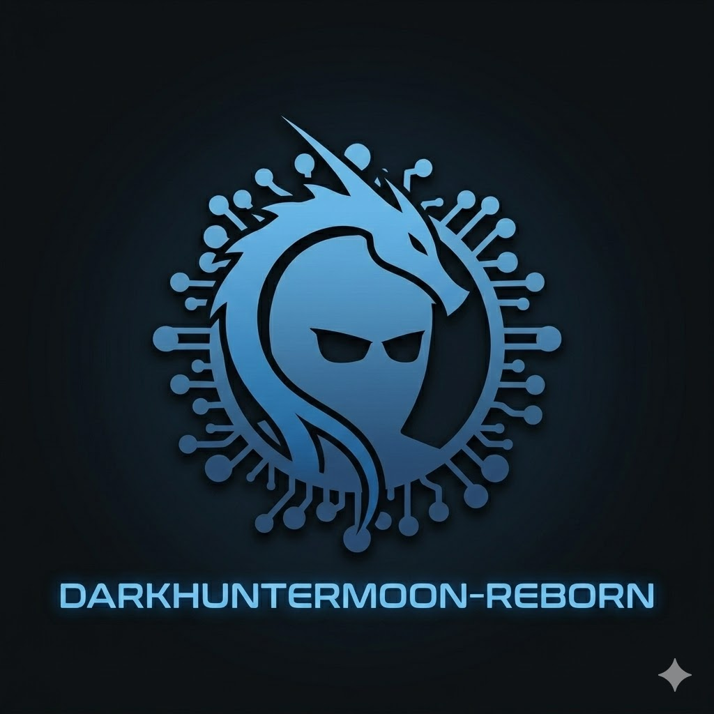

<p align="center">
  
</p>

<h1 align="center">DarkHunterMoon-Reborn</h1>
<p align="center"><i>NetHunter Kernel for Motorola Moto G Stylus 5G 2022 (milanf)</i></p>

<p align="center">
  <a href="https://github.com/edbastida/Kernel_Stone_DarkHuntermoon-Reborn/releases/latest"></a>
  
  
  
</p>

> **Device:** milanf
> **SoC:** Snapdragon 695 5G (SM6375)
> **Kernel:** 5.4.302 (DarkHunterMoon-Reborn)
> **Tested ROM:** LineageOS 23.2

---

## Features

### WiFi & Injection
- External USB WiFi adapter support through the included RTL8188EUS and RTL88x2BU modules
- mac80211 injection support for compatible external adapters
- Internal `wlan0` monitor mode and injection are not enabled by this port; the Motorola qcacld driver in this LineageOS tree does not expose the required monitor-mode controls
- Monitor channel change without restrictions (cfg80211 patch)
- Custom kernel release with the rebuilt module set preloaded from a matching vendor_boot image
- RTL8188EU driver — TL-WN722N v2/v3 (RTL8188EUS)
- RTL88x2BU driver — AC1200 dual-band adapters
- External USB WiFi adapter support

### Kernel
- Loadable kernel module support (.ko)
- USB HID gadget — BadUSB ready
- USB configfs: RNDIS / CDC-ECM
- KernelSU service recovers the milanf DWC3 peripheral role when a data cable is connected and Android has selected a USB data function
- Netfilter / iptables / ip6tables
- Bluetooth attack support + external BT adapter (hcibtusb)
- LTO Clang ThinLTO
- Built-in root via KernelSU Next's legacy driver for this Linux 5.4 kernel

---

## Build

### Requirements
- Ubuntu 22.04+ (or Docker)
- LineageOS clang `clang-r563880c` (Clang 21), selected automatically from `LINEAGEOS_ROOT`; the bundled AOSP compiler is used when that checkout is unavailable
- binutils-aarch64-linux-gnu
- Internet access when source trees, KernelSU Next, toolchains, or driver sources need downloading

### Quick start
```bash
git clone https://github.com/TigerClips1/kali-nethunter-milanf-kernel
cd kali-nethunter-milanf-kernel
bash build.sh
# ZIP → out/zip/nethunter-milanf-5.4.302-<date>.zip
```

### Build options
```bash
bash build.sh                    # full build with KernelSU Next
bash build.sh --step=configure   # integrate KernelSU Next + configure
bash build.sh --step=compile     # configure and compile
bash build.sh --step=package     # configure, compile, and package
bash build.sh --clean            # reset all steps
```

### Environment variables
| Variable | Default | Description |
|---|---|---|
| `SKIP_CLONE` | `` | Set to skip re-cloning repos |
| `KERNEL_BRANCH` | `lineage-23.2` | Kernel source branch |
| `LINEAGEOS_ROOT` | `/mnt/steamgames/Games/los/android/lineage` | LineageOS checkout used to select the matching compiler |
| `DEVICE_CONFIG` | `/home/tigerclips1/config` | Running-device kernel config used as the build baseline when present |
| `STOCK_BOOT_IMAGE` | required | Matching LineageOS milanf `boot.img`; used to preserve the Android ramdisk instead of a recovery ramdisk |
| `STOCK_VENDOR_BOOT_IMAGE` | `$HOME/Downloads/los-stock/vendor_boot.img` | Matching stock vendor_boot v3 image used as the header and DTB base |
| `STOCK_VENDOR_MODULES_LOAD` | `out/vendor-repack/vendor-tree/modules/modules.load` | Ordered module list from the matching ROM's `/vendor/lib/modules/modules.load` |
| `JOBS` | `$(nproc)` | Parallel jobs |

Build with the boot image extracted from the same LineageOS build installed on
the phone. Do not use a TWRP boot image:

```bash
STOCK_BOOT_IMAGE=/path/to/matching/LineageOS/boot.img \
STOCK_VENDOR_BOOT_IMAGE=/path/to/matching/LineageOS/vendor_boot.img \
bash build.sh --step=package
```

The package step emits `out/zip/vendor_boot-nethunter-milanf.img` and bundles
it into the AnyKernel ZIP. The installer flashes it to the same verified slot
as the kernel. It replaces the stock first-stage ramdisk modules with the
rebuilt module set, keeps the ROM's module load order, and preserves the stock
v3 header and DTB.
If the module list is not already extracted, obtain it from the matching ROM
with `adb pull /vendor/lib/modules/modules.load` and set
`STOCK_VENDOR_MODULES_LOAD` to that file.

---

## Root

This device uses Linux 5.4. KernelSU Next requires its driver to be built into
the kernel on this kernel generation, so this build uses the pinned legacy
branch and explicit manual hooks, merged with the Motorola QGKI base and
LineageOS milanf vendor fragments.
Install the matching KernelSU Next Manager app after the ROM boots; root is
provided by the kernel.

The ZIP also installs RTL8188EUS and RTL88x2BU as a KernelSU Next module when
TWRP has decrypted `/data`. If `/data` is encrypted or unavailable in recovery,
install the bundled `ksu_module` directory through KernelSU Next Manager after
Android starts. The drivers do not load during boot; after Android starts,
use the module's action in KernelSU Next Manager to load them on demand.

## Flash

The installer repacks the matching clean LineageOS boot image and always
targets `boot_b` plus `vendor_boot_b`, regardless of the slot TWRP reports. It
checks that both B partitions exist and that the vendor_boot image fits before
flashing either one.

1. Boot into TWRP
2. Install → select ZIP → Swipe to Flash. The installer writes the paired kernel and vendor_boot to slot B.
3. Reboot System and install/open KernelSU Next Manager

The custom kernel and vendor_boot image must be flashed as a pair. The
repackaged vendor_boot has no stock AVB footer; use the already-unlocked
bootloader and verification-disabled setup used for this device.

```bash
adb push out/zip/LineageOS_milanf-By_Community.NH_LineageOS-23.2.KernelSU-Next.*.zip /sdcard/Download/
adb reboot recovery
```

---

## Verify after flash

```bash
# Check built-in KernelSU Next root
su -c id

# Load the NetHunter Realtek Drivers action in KernelSU Next Manager first,
# then connect a supported USB Wi-Fi adapter and check its interface.
iwconfig   # wlan2 present

# Monitor mode
ip link set wlan2 down
iw dev wlan2 set type monitor
ip link set wlan2 up
iw dev wlan2 info   # type: monitor

# Injection test (requires aircrack-ng)
aireplay-ng --test wlan2
# Expected: "Injection is working!"
```

---

## Credits

- [TigerClips1](https://github.com/TigerClips1/kali-nethunter-milanf-kernel) — kernel base (milanf)
- [osm0sis](https://github.com/osm0sis/AnyKernel3) — AnyKernel3
- [KernelSU Next](https://github.com/KernelSU-Next/KernelSU-Next) — built-in legacy kernel root support
- [kimocoder](https://github.com/aircrack-ng) — qcacld-3.0 packet injection upstream
- **Loukious** — co-author of the base injection patch
- **Madara273** — qcacld-3.0 5.4.302 port and ABI fixes
- **dr_rootsu, cyberknight777, HelloWorld, Robin, starsea** — debugging in the QCACLD-3 Telegram group
- [aircrack-ng](https://github.com/aircrack-ng/rtl8188eus) — RTL8188EUS driver
- [RinCat](https://github.com/RinCat/RTL88x2BU-Linux-Driver) — RTL88x2BU driver
- Kali NetHunter team — mac80211 injection patch

---

## License

GPL-2.0 — see [LICENSE](LICENSE)
